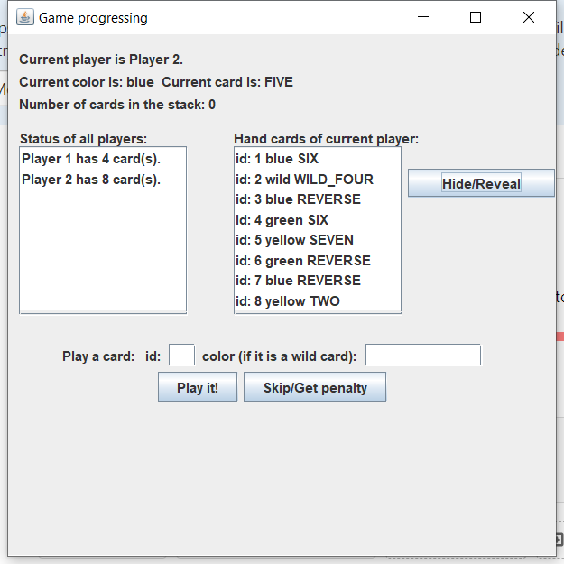

# Manual Test Plan for Controller

## Prerequisites

* jdk-15.0.2

## Environment Setup

* Run the MainLoop class.

## How to scroll the scroll box

Hold your mouse inside the box and move it upwards or downwards.

## Operations and the results

### Game start scene with valid inputs
  
We successfully added three players to our game!  
  

### Game start scene with invalid inputs  
If we try to put some invalid inputs, a popup will complain about this.  

 

### Play a number card
We want to play (id:2 yellow NINE) in this case  
  
We switch to player2's turn. Player1's card has been reduced by one.
The current player's hand cards are automatically hid unless we click hid/reveal button.
The current color and current card are also updated.  

### Play a draw two card
Try to play a draw two card.  
  
The states are updated. Notice that player 2 has been added one card according to the 
split draw rule. There is also one card in the stack. But we can play a blue five 
to avoid penalty.  
  
We will choose to take the penalty at this round.  
  
Now player 1 has been added one card.

### Play a skip card  
We can play a blue skip card at this turn.  
  
Since it is a skip card, the current player can take no action but skip this round and draw one card.

  
The player 1 has draw one card and the current card type is set to none to prevent skip forever.

### Play a change color card

### Check if game over

