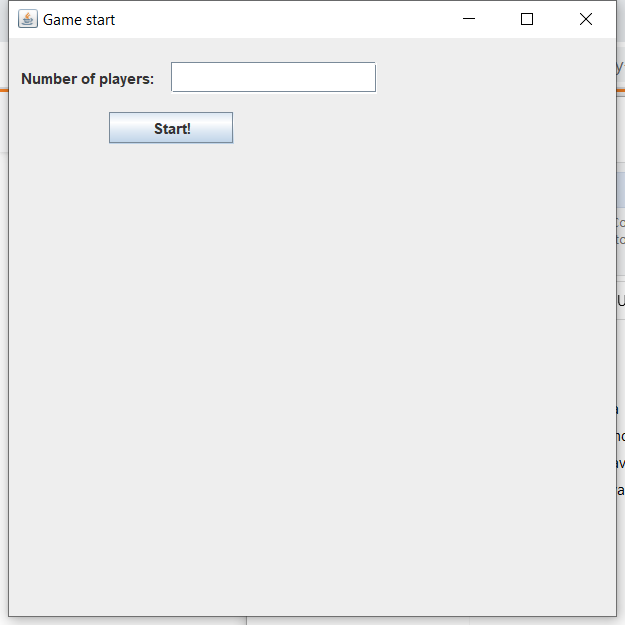
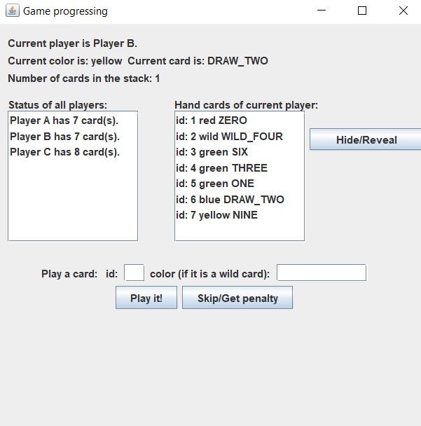
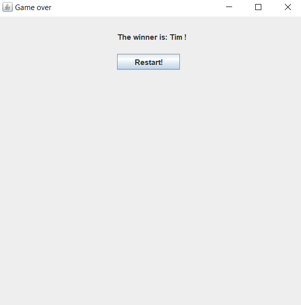

# Manual Test Plan

## Prerequisites

* jdk-15.0.2

## Environment Setup

* Use main methods in each screen class.

## Operations and the results

### Game start scene
Use `new StartScreen()` to show the game start scene. The screen should ask the user  
for the number of players and provide a button to start the game.
  

### During the game scene & Change the color scene
We use the following code to test the during the game scene. Basically we created three  
players, initialize the game, and let the first player play a yellow draw two card.
```java
public static void main(String[] args) {
        // Set up three players
        ArrayList<Player> players = new ArrayList<>();
        Player p1 = new Player("Player A");
        Player p2 = new Player("Player B");
        Player p3 = new Player("Player C");
        players.add(p1);
        players.add(p2);
        players.add(p3);
        Game g = new Game(players);
        g.gameStart();
        // Make player 1 play a yellow draw two card
        p1.addOneCard(new Card(Color.YELLOW, CardType.DRAW_TWO));
        g.playerPlaysACard(new Card(Color.YELLOW, CardType.DRAW_TWO), null);

        // Build the screen
        new PlayerScreen(g);
    }
```  
Check:  
- The states of the game (current player, current card, current color, stack number)  
  should be updated correctly.
  
- The player list has correct amount of players and each player has correct number  
of cards.
  
- The hand card list should show all current player's hand cards with their id,  
color, and type.
  
- The hide/reveal button is shown.

- The user can enter the id of the card he/she wants to play and enter the color he/she  
wants to change if he/she tries to play a wild card (this color input will have no  
  effect if the previous id points to a non-wild card).
  
- The play button and skip button are shown.



Player A played a yellow draw two card, so now is Player B's turn. The number of cards in  
the stack is 1 because we are using split draw custom rule. Same reason for Player C has  
8 cards (C is the previous player of A). B has 7 cards now because the penalty has not  
applied yet. A has 8 - 1 = 7 cards since we manually gave him a card in this test.

### End scene
We pass in the winner player to the screen.
```java
    public static void main(String[] args) {
        Player winner = new Player("Tim");
        new EndScreen(winner);
    }
```


The screen should show the winner's name, and a restart button.